# E-Commerce Sales & Customer Analytics

## Business Intelligence Case Study

This project presents a comprehensive Business Intelligence and Customer Analytics study based on 30,000 e-commerce transactions.

The objective is to transform raw transactional data into actionable business insights through exploratory data analysis (EDA), KPI reporting, customer analytics, profitability analysis, return analysis, and strategic business recommendations.

---

## Executive KPI Dashboard

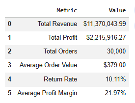


---

## Project Objectives

This analysis focuses on answering the following business questions:

* Which products generate the highest revenue?
* Which categories generate the highest profit?
* How does customer behavior affect profitability?
* How do discounts impact profit margins?
* Which customer segments are most valuable?
* Which product categories experience the highest return rates?
* What strategic actions can improve overall business performance?

---

## Dataset

### Source

This project uses the publicly available **E-Commerce Orders Dataset 2026** published on Kaggle.

Dataset Source:
E-Commerce Orders Dataset 2026 (Kaggle)

https://www.kaggle.com/datasets/mmumairkhattak/e-commerce-orders-dataset-2026-scra

License: MIT

### Dataset Characteristics

* 30,000 transactions
* 41 business-related features
* Customer demographics
* Product information
* Revenue and profit indicators
* Discount and shipping information
* Return behavior metrics
* No missing values

The dataset is used solely for educational and portfolio purposes.

---

## Tools & Technologies

* Python
* Pandas
* NumPy
* Matplotlib
* Seaborn
* Google Colab
* Jupyter Notebook

---

# Revenue Analysis

### Revenue by Product Category

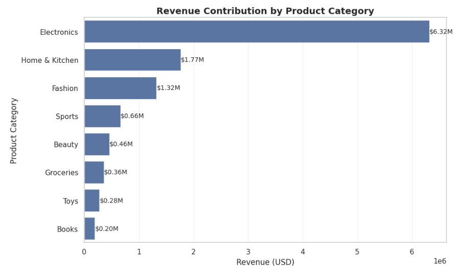

### Revenue by Country

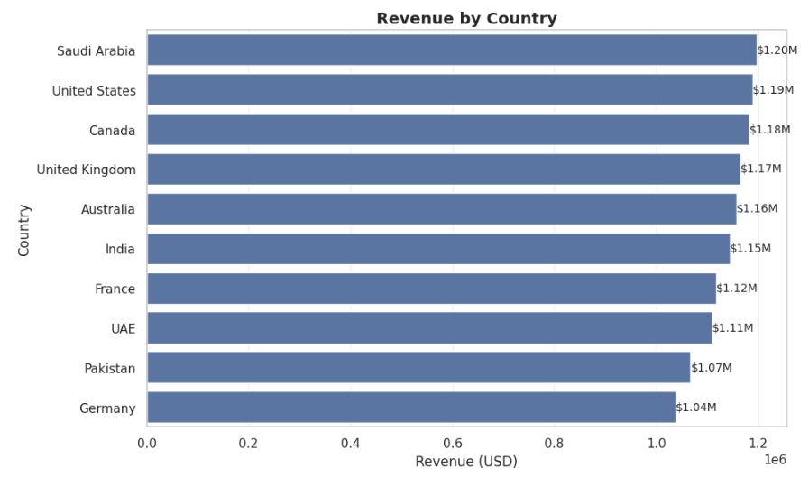

### Monthly Revenue Trend

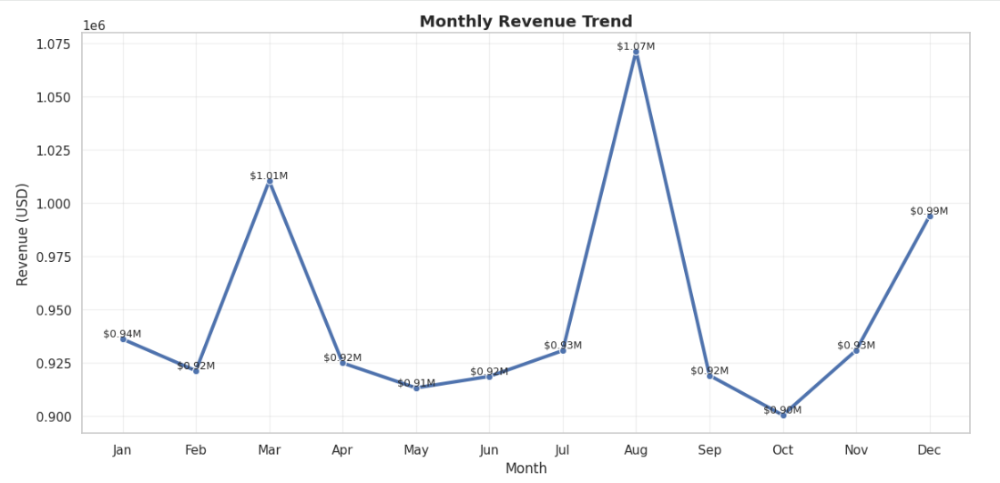

### Revenue Insights

* Electronics generated the highest revenue.
* Revenue distribution across countries was relatively balanced.
* August represented the strongest sales period.
* October recorded the weakest monthly performance.

---

# Customer Analytics

### Customer Segment Distribution

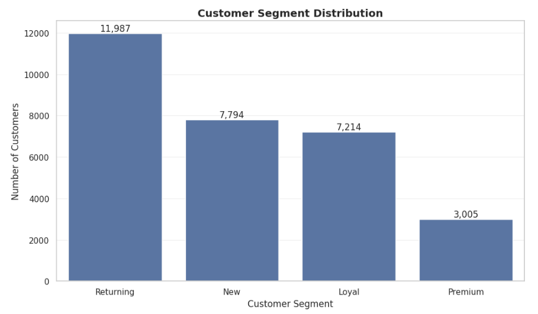

### Customer Age Distribution

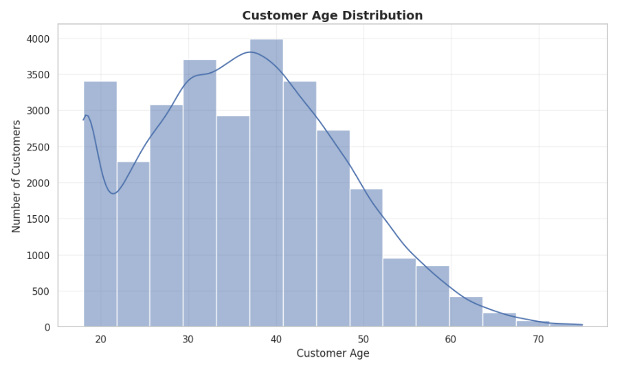

### Customer Gender Distribution

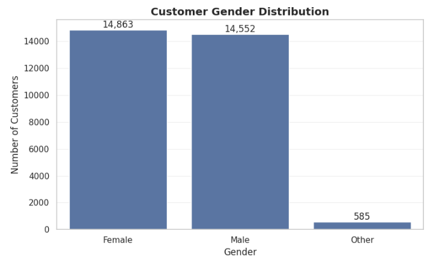

### Customer Lifetime Value Distribution

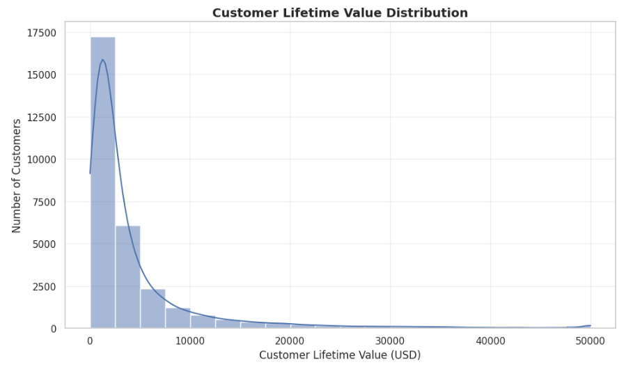

### Customer Insights

* Returning customers represented approximately 40% of the customer base.
* The average customer age was approximately 36 years.
* Gender distribution was nearly balanced.
* Customer Lifetime Value was highly right-skewed, indicating a valuable high-spending customer segment.

---

# Profitability Analysis

### Profit by Product Category

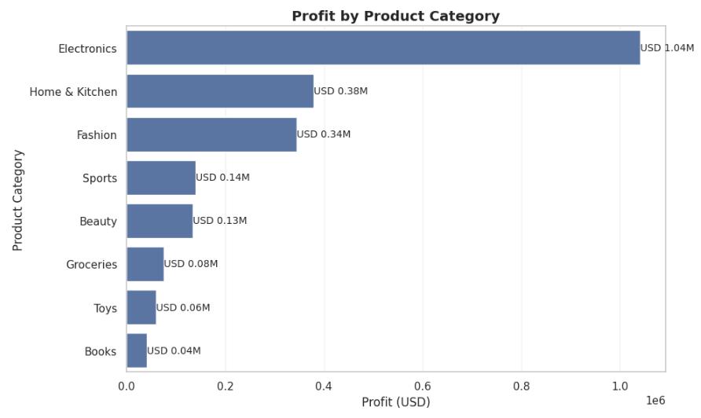

### Profit Margin by Product Category

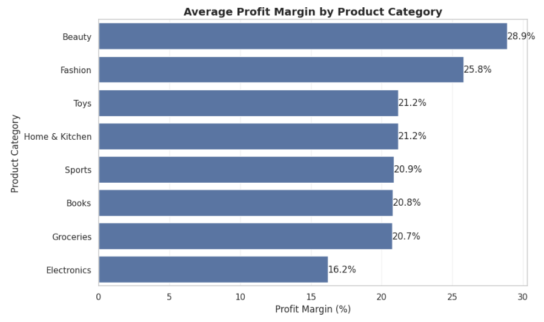

### Impact of Discounts on Profitability

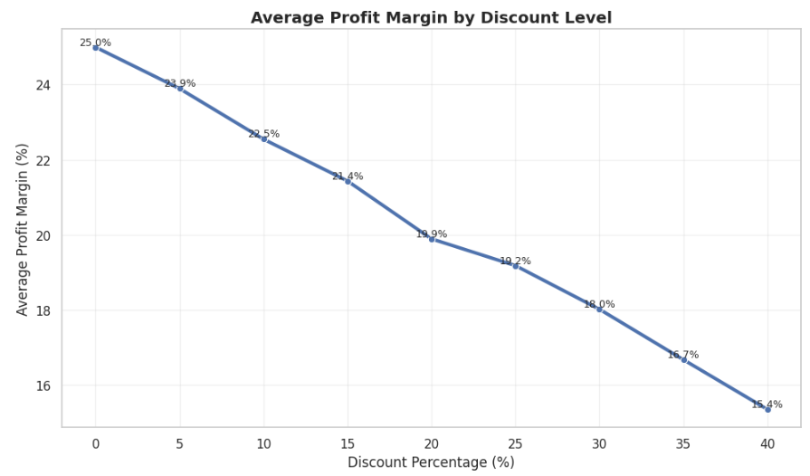

### Profitability Insights

* Electronics generated the highest absolute profit.
* Beauty and Fashion achieved the highest profit margins.
* Higher discount levels consistently reduced profit margins.
* Profitability remained healthy across most categories.

---

# Return Analysis

### Return Rate by Product Category

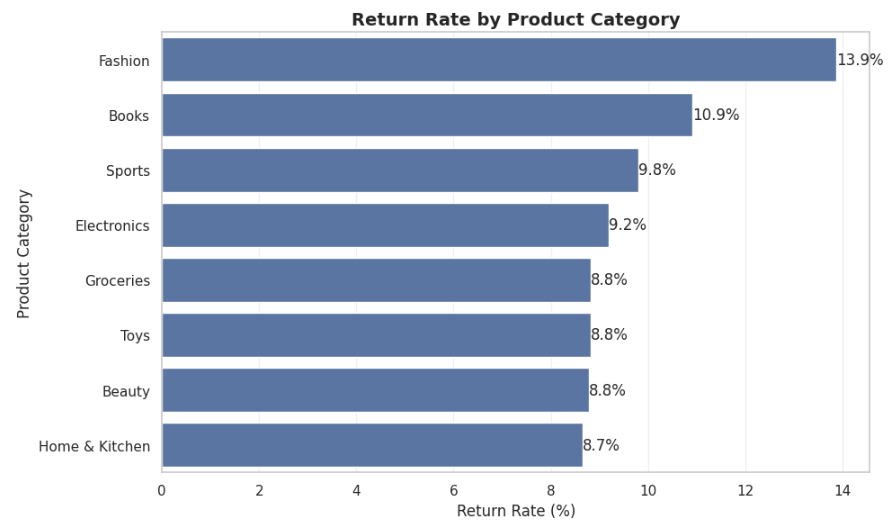

### Return Insights

* Overall return rate was approximately 10.1%.
* Fashion products experienced the highest return rates.
* Electronics maintained moderate return rates despite strong sales volume.
* Return management presents a significant opportunity for cost optimization.

---

# Key Findings

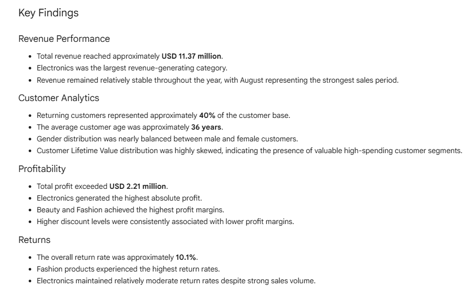


---

# Business Recommendations

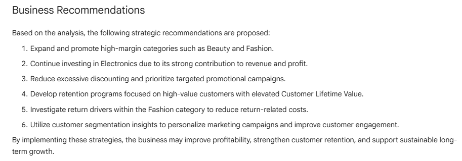


---

## Repository Structure

```text
E-Commerce-Sales-Customer-Analytics/
│
├── images/
│   ├── KPI_dashboard.png
│   ├── revenue_by_category.png
│   ├── revenue_by_country.png
│   ├── monthly_revenue.png
│   ├── customer_segments.png
│   ├── customer_age_distribution.png
│   ├── customer_gender_distribution.png
│   ├── clv_distribution.png
│   ├── profit_by_category.png
│   ├── profit_margin.png
│   ├── discount_impact.png
│   ├── return_rate.png
│   ├── key_findings.png
│   └── business_recommendations.png
│
├── ecommerce_orders_dataset.csv
├── E_Commerce_Sales_&_Customer_Analytics.ipynb
├── README.md
└── LICENSE
```

---

## Author

CoreLogic Labs

Business Intelligence | Data Analytics | Customer Analytics | Python

GitHub:
https://github.com/CoreLogicLabs
